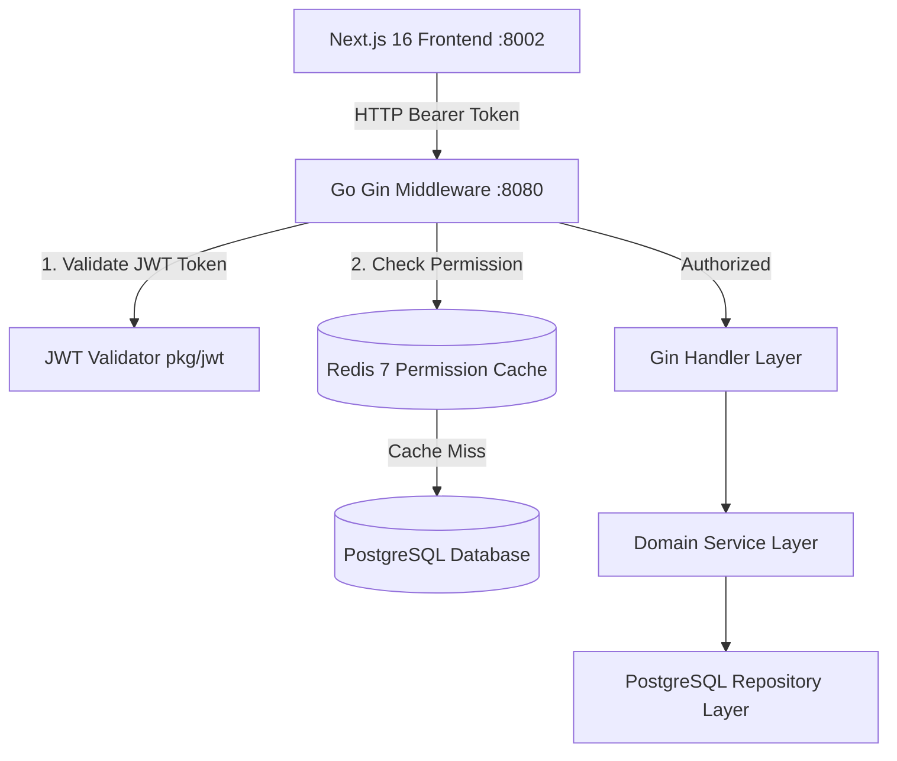

# Architecture Principles & Design - SITIVENT (Untitled Monorepo)

> **Version**: 1.0.0  
> **Paradigm**: Turborepo Polyglot Monorepo, Go Clean Architecture (Gin REST API), Next.js 16 App Router, PBAC Multi-Tier Access Guard

---

## 1. Prinsip Utama Desain Monorepo

1. **Polyglot Monorepo Separation**:
   - `apps/backend/`: Layanan backend performa tinggi ditulis dalam **Go 1.25+ (Gin)** yang menangani seluruh operasi basis data, transaksi bisnis, autentikasi JWT, hashing kata sandi, antrean email, verifikasi pembayaran, dan presensi QR.
   - `apps/frontend/`: Aplikasi antarmuka berbasis **Next.js 16 (React 19)** yang melayani portal publik, dashboard admin panitia, dan dashboard peserta mandiri.
   - `packages/`: Paket utilitas dan tipe bersama antarlayanan monorepo di masa depan.

2. **Clean Layered Architecture di Backend (`apps/backend`)**:
   - **Handler Layer (`internal/handlers/`)**: Menangani binding HTTP request, validasi format, dan format HTTP response standard (`pkg/response`).
   - **Service Layer (`internal/services/`)**: Inti logika bisnis, validasi aturan domain, hashing, dan orkestrasi antar-repository.
   - **Repository Layer (`internal/repositories/`)**: Abstraksi kueri database PostgreSQL (`sql.Tx`, batching, transactional safety).
   - **Middleware Layer (`internal/middleware/`)**: JWT extraction, CORS, Zap structured logging, dan PBAC permission checks via Redis.

3. **Client-Side Data Layer di Frontend (`apps/frontend`)**:
   - **Service / API Client (`src/services/`)**: Pemanggilan endpoint backend via HTTP client **Ky** yang dibungkus oleh **TanStack React Query** hooks untuk caching dan optimistik UI updates.
   - **Section & Components (`src/sections/`, `src/components/`)**: UI modern berbasis Material UI v9 & Tailwind CSS v4.

---

## 2. Struktur Route & API Endpoints

### A. Next.js 16 Route Groups (`apps/frontend/src/app/`)

```text
src/app/
├── (admin)/               # Panel Administrator & Manajemen Event (Port 8002)
│   └── admin/
│       ├── dashboard/     # Analitik & ringkasan statistik
│       ├── events/        # CRUD Event, kategori, pembicara, fasilitas
│       ├── registrations/ # Manajemen peserta & verifikasi pembayaran
│       ├── attendance/    # QR Scanner & validasi kehadiran
│       ├── certificates/  # Template builder & penerbitan sertifikat
│       ├── articles/      # Publikasi artikel & kategori
│       ├── galleries/     # Dokumentasi foto kegiatan
│       ├── users/         # Manajemen pengguna & role (PBAC)
│       └── support/       # Tiket pesan bantuan peserta
│
├── (participant)/         # Panel Peserta Mandiri
│   └── participant/
│       ├── dashboard/     # Kartu event terdekat & ringkasan akun
│       ├── events/        # Riwayat pendaftaran event & tiket QR
│       ├── payments/      # Status pembayaran & form upload bukti transfer
│       ├── certificates/  # Unduh sertifikat digital
│       └── profile/       # Data diri peserta
│
├── (auth)/                # Autentikasi Publik
│   ├── login/
│   ├── register/
│   ├── forgot-password/
│   └── reset-password/
│
├── (root)/                # Portal Landing Page & Katalog Publik
│   ├── page.tsx           # Landing page utama
│   ├── events/            # Katalog & filter event
│   ├── events/[slug]/     # Detail event & pendaftaran
│   ├── articles/          # Publikasi artikel & tips
│   ├── gallery/           # Galeri dokumentasi
│   └── support/           # Formulir bantuan publik
│
└── certificates/[id]/     # Halaman Verifikasi Sertifikat Publik (QR Scan)
```

### B. Go REST API Architecture (`apps/backend`)

- Base URL: `http://localhost:8080`
- `GET  /health` - Health check endpoint
- `POST /core/v1/auth/signup` - Registrasi akun baru
- `POST /core/v1/auth/signin` - Login & token JWT issue
- `POST /core/v1/auth/refresh` - Refresh access token
- `GET  /core/v1/users` - Manajemen pengguna (Admin)
- `GET  /core/v1/roles` - Manajemen jabatan & hak akses (PBAC)
- `GET  /features/v1/events` - Katalog & CRUD event
- `POST /features/v1/registrations` - Pendaftaran event
- `POST /features/v1/payments/verify` - Verifikasi bukti bayar
- `POST /features/v1/attendances/scan` - Validasi scan QR kehadiran
- `GET  /features/v1/certificates/:id` - Verifikasi sertifikat digital

---

## 3. Sistem Keamanan & Otorisasi Berlapis (Three-Tier Security)



1. **JWT & Redis PBAC Middleware (Backend)**:
   - Middleware `RequireAuth()` memvalidasi signature dan expired time access token.
   - Middleware `RequirePermission("event.create")` mengecek permission array user di Redis (TTL 10 menit).
2. **Frontend Route Proxy / Guard**:
   - Memastikan pengguna tanpa token login diarahkan ke `/login`.
   - Mengalihkan pengguna non-admin jika mencoba mengakses rute `/admin/*`.
3. **UI Permission Directives (`usePermission` Hook)**:
   - Komponen aksi (tombol Create, Edit, Delete, Verify) hanya dirender jika user memiliki permission terkait.
