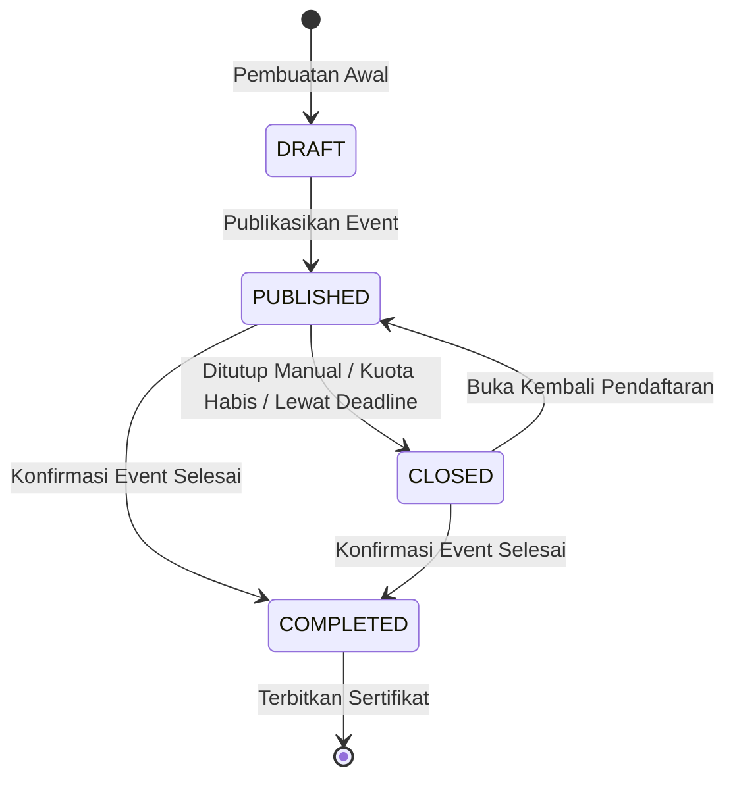

# Event Module - SITIVENT (Untitled Monorepo)

> **Version**: 1.0.0  
> Modul utama penyelenggaraan event yang mengelola informasi acara, pembicara, fasilitas, kuota, harga, dan siklus hidup penerbitan event.

---

## 1. Skema & Atribut Data Event

Tabel PostgreSQL `events` mencakup atribut:

| Field | Tipe Data | Deskripsi |
| :--- | :--- | :--- |
| `id` | `VARCHAR(36) PK` | Identifier unik event (UUID v4) |
| `title` | `VARCHAR(255)` | Judul event |
| `slug` | `VARCHAR(255) UNIQUE` | URL-friendly identifier yang digenerate otomatis |
| `description` | `TEXT` | Konten deskripsi kaya format HTML (Tiptap / RichText) |
| `banner` | `TEXT` | URL gambar cover/banner di ImageKit / GCS |
| `start_date` | `TIMESTAMPTZ` | Tanggal mulai acara |
| `end_date` | `TIMESTAMPTZ` | Tanggal selesai acara |
| `start_time` | `VARCHAR(10)` | Waktu mulai (contoh: "09:00") |
| `end_time` | `VARCHAR(10)` | Waktu selesai (contoh: "17:00") |
| `location` | `VARCHAR(255)` | Lokasi fisik atau catatan pertemuan virtual |
| `event_type` | `event_type` | Enum: `ONLINE` atau `OFFLINE` |
| `online_attendance` | `BOOLEAN` | Flag apakah presensi dapat dilakukan secara daring |
| `meeting_link` | `TEXT` | URL pertemuan virtual (Zoom / Google Meet) untuk event online |
| `registration_deadline` | `TIMESTAMPTZ` | Batas akhir penerimaan pendaftaran peserta |
| `quota` | `INTEGER` | Kapasitas maksimal peserta |
| `price` | `INTEGER` | Harga tiket dalam Rupiah (`0` = Gratis) |
| `status` | `event_status` | Enum: `DRAFT`, `PUBLISHED`, `CLOSED`, `COMPLETED` |
| `certificate_enabled` | `BOOLEAN` | Flag apakah event menerbitkan sertifikat digital |
| `published_at` | `TIMESTAMPTZ` | Waktu publikasi ke publik |
| `category_id` | `VARCHAR(36)` | Relasi FK ke `event_categories(id)` |
| `created_by_id` | `VARCHAR(36)` | Relasi FK ke `users(id)` pembuat event |
| `deleted_at` | `TIMESTAMPTZ` | Waktu soft delete |

### Relasi Pendukung:

- **event_benefits**: Daftar fasilitas (title, description, icon, order).
- **event_speakers**: Daftar narasumber/pembicara (name, title, company, company_url, github, instagram, linked_in, avatar, order).
- **certificate_templates**: Desain layout dan tanda tangan sertifikat digital khusus event.
- **registrations**, **galleries**, **testimonials**.

---

## 2. Siklus Hidup Status Event (Lifecycle Transitions)

- **DRAFT**: Status awal. Event tersembunyi dari katalog publik, hanya terlihat oleh admin/panitia.
- **PUBLISHED**: Event tampil di katalog publik dan siap menerima pendaftaran peserta baru.
- **CLOSED**: Pendaftaran ditutup. Event tetap tampil namun tombol pendaftaran dinonaktifkan.
- **COMPLETED**: Acara telah selesai diselenggarakan. Sertifikat digital dapat digenerate dan didistribusikan kepada peserta yang hadir (`CHECKED_IN`).

---

## 3. Aturan & Validasi Bisnis (Business Validation Rules)

1. **Validasi Kuota**: Kuota tidak boleh bernilai negatif (`quota >= 1`).
2. **Validasi Batas Waktu (Deadline)**: `registration_deadline` harus lebih kecil atau sama dengan tanggal mulai event (`registration_deadline <= start_date`).
3. **Validasi Jadwal**: `end_date >= start_date`.
4. **Proteksi Modifikasi Event Selesai**: Event berstatus `COMPLETED` dilarang diubah datanya kecuali oleh pengguna ber-role `superadmin`.
5. **Pencegahan Soft Delete**: Penghapusan event hanya mengisi field `deleted_at` dan mengecualikannya dari kueri publik dan kalkulasi kuota.
