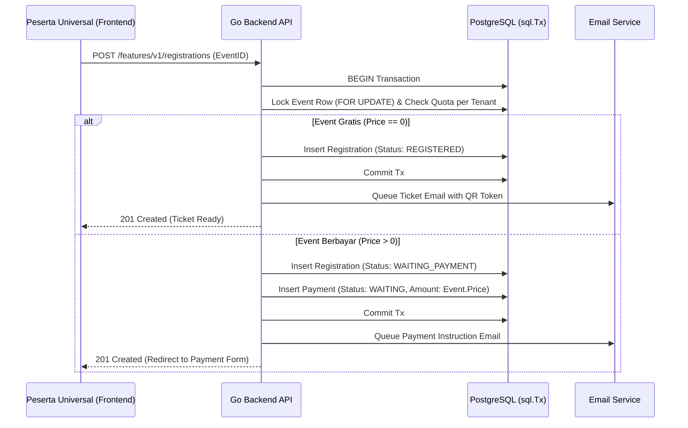

# Registration Module - SITIVENT (Untitled Monorepo)

> **Version**: 1.0.0  
> Modul pengelolaan pendaftaran peserta event (Universal Participant Registration), generasi nomor registrasi unik, alokasi QR Code, dan validasi kuota secara transaksional lintas fakultas.

---

## 1. Skema & Atribut Data Registrasi

Tabel PostgreSQL `registrations` mencakup atribut:

| Field | Tipe Data | Deskripsi |
| :--- | :--- | :--- |
| `id` | `VARCHAR(36) PK` | Identifier unik registrasi (UUID v4) |
| `event_id` | `VARCHAR(36)` | Relasi FK ke `events(id)` (Event Fakultas / Rektorat) |
| `user_id` | `VARCHAR(36)` | Relasi FK ke `users(id)` akun peserta universal |
| `registration_number` | `VARCHAR(100) UNIQUE` | Format: `REG-{TENANT_CODE}-{SLUG}-{YEAR}-{COUNTER}` |
| `qr_token` | `VARCHAR(255) UNIQUE` | Token rahasia unik untuk QR Code presensi |
| `online_attendance` | `BOOLEAN` | Pilihan metode kehadiran peserta (online/offline) |
| `status` | `registration_status` | `WAITING_PAYMENT`, `REGISTERED`, `CANCELLED`, `CHECKED_IN` |
| `created_at` | `TIMESTAMPTZ` | Waktu submit pendaftaran |
| `updated_at` | `TIMESTAMPTZ` | Waktu update terakhir |
| `deleted_at` | `TIMESTAMPTZ` | Waktu pembatalan / soft delete |

---

## 2. Alur Pendaftaran Lintas Fakultas

Mahasiswa atau peserta umum menggunakan satu akun universal untuk mendaftar ke berbagai acara di fakultas manapun:

---

## 3. Validasi & Ketentuan Pendaftaran

1. **Pencegahan Pendaftaran Ganda**: Satu `user_id` dilarang mendaftar ke `event_id` yang sama lebih dari satu kali jika status pendaftaran aktif (`REGISTERED`, `WAITING_PAYMENT`, atau `CHECKED_IN`).
2. **Kunci Baris Transaksional**: Go Backend wajib menggunakan `SELECT ... FOR UPDATE` saat memeriksa sisa kuota event sebelum insert data registrasi guna mencegah *race condition* / *overselling*.
3. **Penerbitan QR Token**: Token QR dibuat menggunakan random cryptographic string (`crypto/rand`) yang unik dan tidak dapat ditebak.
