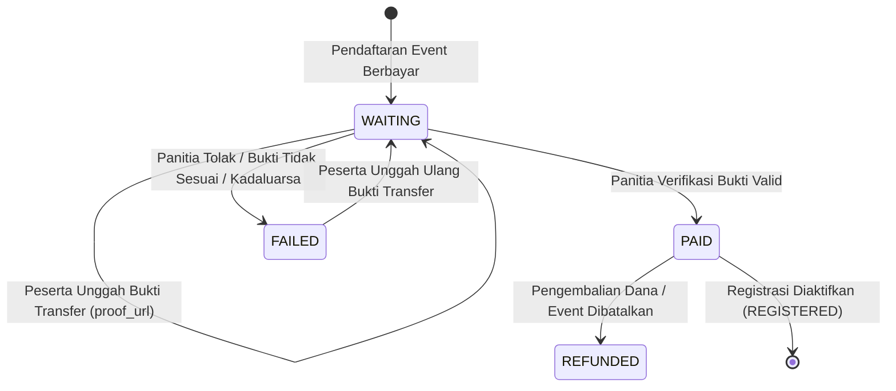

# Payment Module - SITIVENT (Untitled Monorepo)

> **Version**: 1.0.0  
> Modul pengelolaan pembayaran tiket event berbayar, unggah bukti transfer manual, verifikasi pembayaran oleh panitia, dan pencatatan audit trail.

---

## 1. Skema & Atribut Data Pembayaran

Tabel PostgreSQL `payments` mencakup atribut:

| Field | Tipe Data | Deskripsi |
| :--- | :--- | :--- |
| `id` | `VARCHAR(36) PK` | Identifier unik pembayaran (UUID v4) |
| `registration_id` | `VARCHAR(36) UNIQUE` | Relasi FK ke `registrations(id)` |
| `amount` | `INTEGER` | Nominal pembayaran tiket dalam Rupiah |
| `status` | `payment_status` | `WAITING`, `PAID`, `FAILED`, `REFUNDED` |
| `proof_url` | `TEXT` | URL file gambar bukti transfer (ImageKit / GCS) |
| `verified_at` | `TIMESTAMPTZ` | Waktu verifikasi oleh panitia |
| `verified_by_id` | `VARCHAR(36)` | Relasi FK ke `users(id)` panitia yang memverifikasi |
| `created_at` | `TIMESTAMPTZ` | Waktu record pembayaran dibuat |
| `updated_at` | `TIMESTAMPTZ` | Waktu update status pembayaran |
| `deleted_at` | `TIMESTAMPTZ` | Waktu soft delete |

---

## 2. Alur Pembayaran & Verifikasi Panitia

1. **Unggah Bukti Transfer (Peserta)**:
   - Peserta mengunggah foto bukti transfer (JPG, PNG, WebP $\le$ 5MB).
   - Backend memvalidasi tipe file dan menyimpan URL ke kolom `proof_url`.
2. **Verifikasi Pembayaran (Panitia)**:
   - Panitia dengan permission `payments.verify` memeriksa kesesuaian nominal dan rekening pengirim.
   - Jika valid: Status pembayaran berubah menjadi `PAID`, status registrasi peserta berubah dari `WAITING_PAYMENT` menjadi `REGISTERED`, dan token tiket QR diaktifkan.
   - Jika ditolak: Status pembayaran menjadi `FAILED` disertai catatan alasan penolakan.
3. **Audit Trail**:
   - Setiap perubahan status diverifikasi dan dicatat pada tabel `audit_logs` (`verified_by_id`, `old_values`, `new_values`).
