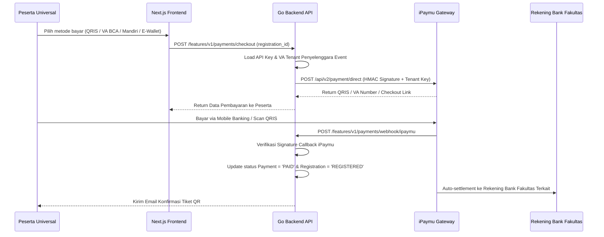

# Payment Module - SITIVENT (Untitled Monorepo)

> **Version**: 1.0.0  
> Modul pengelolaan pembayaran tiket event berbayar multi-tenant dengan integrasi **iPaymu Payment Gateway** (Multi-Credential per Tenant), webhook otomatis, dan fallback transfer manual.

---

## 1. Arsitektur Pembayaran Multi-Tenant (iPaymu Direct Settlement)

Untuk menjamin dana pendaftaran event tidak tercampur antar-fakultas:
1. **Multi-Credential iPaymu**: Setiap Fakultas dan Rektorat memiliki akun/kredensial iPaymu (`api_key` dan `virtual_account`) tersendiri yang tersimpan pada tabel `tenant_payment_gateways`.
2. **Direct Tenant Routing**: Saat peserta mendaftar event berbayar Fasilkom, request checkout diarahkan ke API iPaymu menggunakan API Key Fasilkom $\rightarrow$ Dana masuk ke saldo iPaymu Fasilkom dan ditarik langsung ke rekening bank bendahara Fasilkom.
3. **Automated Webhook Activation**: Notifikasi callback dari iPaymu (`POST /features/v1/payments/webhook/ipaymu`) memverifikasi signature dan langsung mengaktifkan tiket QR peserta tanpa perlu intervensi manual panitia.

---

## 2. Skema & Model Database Pembayaran

### A. Tabel Konfigurasi Gateway Tenant (`tenant_payment_gateways`)

| Field | Tipe Data | Deskripsi |
| :--- | :--- | :--- |
| `id` | `VARCHAR(36) PK` | Identifier unik konfigurasi gateway (UUID v4) |
| `tenant_id` | `VARCHAR(36) UNIQUE` | Relasi FK ke `tenants(id)` (Fakultas / Rektorat) |
| `provider` | `VARCHAR(50)` | `IPAYMU`, `MANUAL` |
| `is_active` | `BOOLEAN` | Status aktif integrasi gateway |
| `api_key` | `TEXT` | API Key iPaymu milik tenant |
| `virtual_account` | `VARCHAR(100)` | Nomor VA master / username iPaymu tenant |
| `env` | `VARCHAR(20)` | Mode: `sandbox` atau `production` |
| `bank_name` | `VARCHAR(50)` | Nama bank resmi (contoh: "Bank Mandiri") |
| `bank_account_number` | `VARCHAR(50)` | Nomor rekening kas fakultas |
| `bank_account_holder` | `VARCHAR(150)` | Nama pemilik rekening resmi |

### B. Tabel Transaksi Pembayaran (`payments`)

| Field | Tipe Data | Deskripsi |
| :--- | :--- | :--- |
| `id` | `VARCHAR(36) PK` | Identifier unik pembayaran (UUID v4) |
| `registration_id` | `VARCHAR(36) UNIQUE` | Relasi FK ke `registrations(id)` |
| `amount` | `INTEGER` | Nominal pembayaran tiket dalam Rupiah |
| `status` | `payment_status` | `WAITING`, `PAID`, `FAILED`, `REFUNDED` |
| `provider` | `VARCHAR(50)` | `IPAYMU`, `MANUAL` |
| `transaction_id` | `VARCHAR(100)` | ID Transaksi iPaymu / `sid` |
| `payment_method` | `VARCHAR(50)` | `QRIS`, `VA`, `EWALLET`, `CONVENIENCE_STORE` |
| `payment_channel` | `VARCHAR(50)` | `BCA`, `MANDIRI`, `BNI`, `BRI`, `GOPAY`, `OVO`, `DANA` |
| `payment_url` | `TEXT` | URL redirect pembayaran atau URL barcode QRIS |
| `proof_url` | `TEXT` | Bukti transfer (khusus transfer manual) |
| `expired_at` | `TIMESTAMPTZ` | Batas kedaluwarsa waktu pembayaran |
| `verified_at` | `TIMESTAMPTZ` | Waktu verifikasi otomatis / manual |
| `verified_by_id` | `VARCHAR(36)` | FK ke `users(id)` (NULL jika otomatis via Webhook) |

---

## 3. Metode Pembayaran yang Didukung (via iPaymu)

1. **QRIS Real-Time**: BCA Mobile, Livin by Mandiri, GoPay, OVO, Dana, ShopeePay, LinkAja.
2. **Virtual Account (VA)**: BCA, Mandiri, BNI, BRI, Permata, CIMB Niaga, BSI (Bank Syariah).
3. **E-Wallet Direct**: OVO, Dana, ShopeePay.
4. **Convenience Store**: Indomaret, Alfamart.
5. **Fallback Transfer Manual**: Rekening bank bendahara fakultas dengan upload bukti bayar dan verifikasi panitia.
