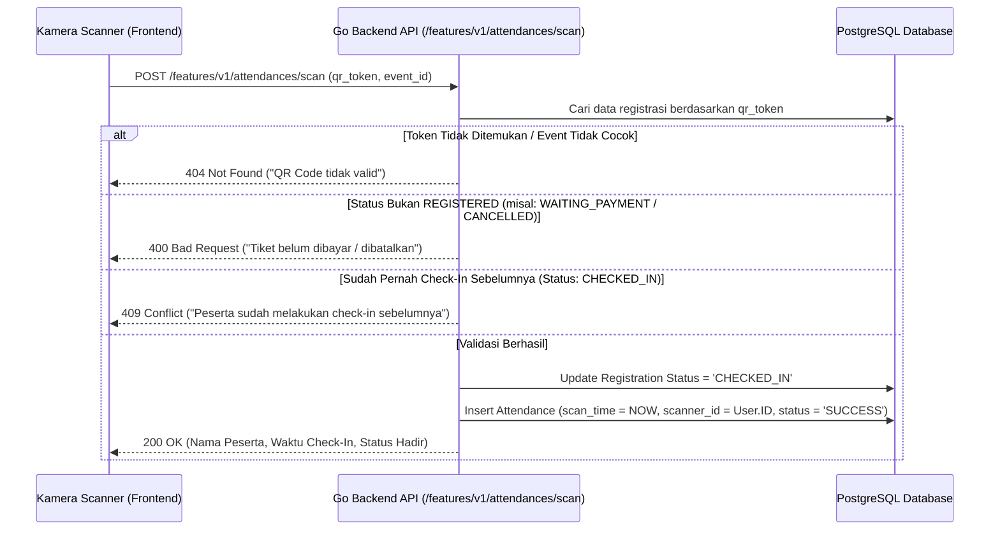

# Attendance & QR Scanner Module - SITIVENT (Untitled Monorepo)

> **Version**: 1.0.0  
> Modul validasi kehadiran peserta di lokasi acara secara langsung via kamera perangkat (HTML5 QR Scanner) dan pencatatan presensi real-time.

---

## 1. Skema & Atribut Data Kehadiran

Tabel PostgreSQL `attendances` mencakup atribut:

| Field | Tipe Data | Deskripsi |
| :--- | :--- | :--- |
| `id` | `VARCHAR(36) PK` | Identifier unik presensi (UUID v4) |
| `registration_id` | `VARCHAR(36) UNIQUE` | Relasi FK ke `registrations(id)` |
| `scan_time` | `TIMESTAMPTZ NOT NULL DEFAULT NOW()` | Waktu tepat saat barcode dipindai |
| `scanner_id` | `VARCHAR(36)` | Relasi FK ke `users(id)` petugas pemindai |
| `status` | `attendance_status` | `SUCCESS`, `FAILED` |

---

## 2. Alur Kerja Pemindaian QR Code

---

## 3. Ketentuan & Keamanan Pemindaian

1. **Hak Akses Petugas**: Hanya pengguna ber-role `superadmin`, `panitia`, atau `scanner` dengan permission `attendance.scan` yang diizinkan mengakses scanner dan memanggil endpoint `/features/v1/attendances/scan`.
2. **Pencegahan Double Check-in**: Kueri pencatatan presensi bersifat atomic. Setelah status registrasi menjadi `CHECKED_IN`, percobaan scan ulang dengan token yang sama akan langsung ditolak dengan pesan peringatan waktu check-in sebelumnya.
3. **Syarat Sertifikat**: Peserta yang berstatus `CHECKED_IN` otomatis berhak mengunduh sertifikat saat event berstatus `COMPLETED`.
