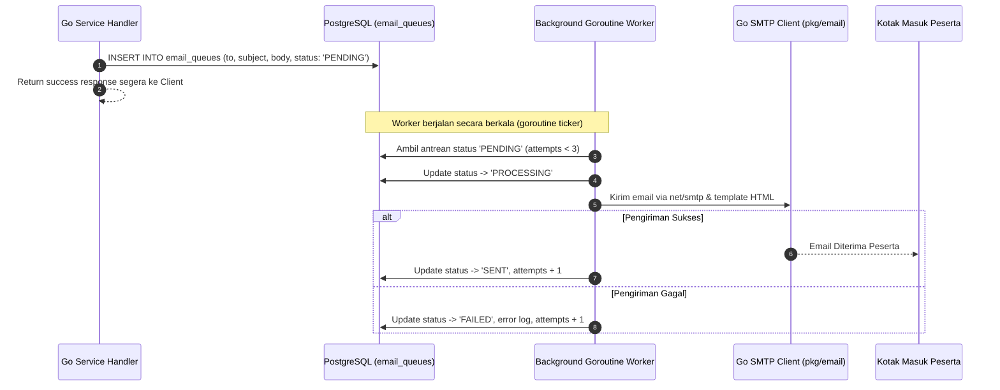

# Email Architecture & Queue - SITIVENT (Untitled Monorepo)

> **Version**: 1.0.0  
> Seluruh komunikasi email transaksional diproses secara asinkron menggunakan sistem antrean database (`email_queues`) untuk menjamin performa request utama tetap instan.

---

## 1. Skema Database Antrean Email (`email_queues`)

Tabel PostgreSQL `email_queues`:

| Field | Tipe Data | Deskripsi |
| :--- | :--- | :--- |
| `id` | `VARCHAR(36) PK` | Identifier unik antrean email (UUID v4) |
| `to` | `VARCHAR(255)` | Alamat email penerima |
| `subject` | `VARCHAR(255)` | Judul subjek email |
| `body` | `TEXT` | Konten pesan dalam format HTML responsif |
| `attachments` | `TEXT` | JSON metadata berkas lampiran (QR Code / PDF) |
| `status` | `email_status` | Enum: `PENDING`, `PROCESSING`, `SENT`, `FAILED` |
| `attempts` | `INTEGER DEFAULT 0` | Jumlah percobaan pengiriman |
| `error` | `TEXT` | Pesan error log jika pengiriman gagal |
| `created_at` | `TIMESTAMPTZ` | Waktu pesan dimasukkan ke antrean |
| `updated_at` | `TIMESTAMPTZ` | Waktu pembaruan status |

---

## 2. Alur Kerja Antrean Asinkron (Asynchronous Queue Flow)

---

## 3. Jenis Email Transaksional

1. **Email Verifikasi Akun**: Tautan aktivasi akun saat registrasi user baru.
2. **Email Reset Password**: Tautan token perubahan kata sandi yang aman.
3. **Konfirmasi Registrasi Event**: Konfirmasi pendaftaran event dengan instruksi pembayaran transfer.
4. **Persetujuan Pembayaran & Tiket QR**: Notifikasi pembayaran sukses yang menyertakan tiket QR Code untuk check-in.
5. **Pengingat Event (Event Reminder)**: Email pengingat H-1 sebelum jadwal event dimulai.
6. **Distribusi Sertifikat Digital**: Pemberitahuan sertifikat selesai dengan lampiran PDF sertifikat resmi.

---

## 4. Konfigurasi Lingkungan (Environment Setup)

Pengiriman email di Go Backend dikonfigurasi melalui `pkg/email/smtp.go` dengan variabel lingkungan:

- `SMTP_HOST`: Host server SMTP (contoh: `smtp.gmail.com` atau provider transactional mail).
- `SMTP_PORT`: Port SMTP (contoh: `587` untuk STARTTLS).
- `SMTP_USER`: Username / email akun pengirim.
- `SMTP_PASSWORD`: Password aplikasi / API token.
- `SMTP_FROM_EMAIL`: Alamat email pengirim (contoh: `noreply@untitled.com`).
- `SMTP_FROM_NAME`: Nama pengirim (contoh: `"SITIVENT"`).
