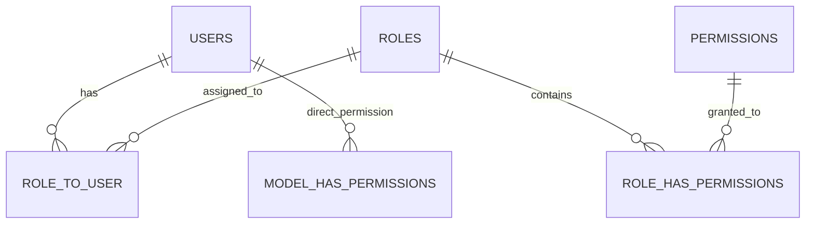

# Authorization & Access Control - SITIVENT (Untitled Monorepo)

> **Version**: 1.0.0  
> **Pattern**: Permission-Based Access Control (PBAC) dengan Redis In-Memory Permission Cache

---

## 1. Model Hubungan PBAC



- **User**: Entitas pengguna yang memiliki token login JWT.
- **Role**: Kelompok hak akses (`superadmin`, `panitia`, `scanner`, `peserta`).
- **Permission**: Aksi atomic yang diizinkan (format `module.action`, contoh: `events.create`, `attendance.scan`, `payments.verify`).

---

## 2. Implementasi Otorisasi di Go Backend (`apps/backend`)

### A. JWT Token Claims & Verification
Saat pengguna berhasil melakukan autentikasi di `POST /core/v1/auth/signin`, backend Go mengembalikan JWT access token yang memuat identitas pengguna:
- `user_id`: UUID pengguna
- `email`: Alamat email
- `roles`: Array nama jabatan pengguna
- `iss`: `"untitled-api"`

### B. Redis In-Memory Permission Cache (`internal/shared/authz`)
Untuk menjaga ukuran JWT tetap ringkas dan performa kueri middleware tetap di bawah 1ms:
1. Saat request dengan token tiba, middleware `RequirePermission(permName)` membaca daftar permissions pengguna dari **Redis Cache** (`user_permissions:{userId}`).
2. Jika terjadi cache-miss, backend mengambil daftar permission dari database PostgreSQL dan menyimpannya di Redis dengan TTL 10 menit.
3. Saat admin mengubah hak akses pengguna/role, cache Redis di-invalidate seketika.

### C. Contoh Penggunaan di Router Go:
```go
// Endpoint publik
featuresV1.GET("/events", eventHandler.List)

// Endpoint yang memerlukan autentikasi
authGroup := featuresV1.Group("", middleware.RequireAuth())
{
    // Hanya user dengan permission 'events.create' (misal: panitia/superadmin)
    authGroup.POST("/events", middleware.RequirePermission("events.create"), eventHandler.Create)
    
    // Hanya user dengan permission 'attendance.scan' (scanner/panitia)
    authGroup.POST("/attendances/scan", middleware.RequirePermission("attendance.scan"), attendanceHandler.Scan)
}
```

---

## 3. Implementasi Otorisasi di Next.js Frontend (`apps/frontend`)

1. **Route Guard Middleware / Proxy**:
   - Memeriksa ketersediaan token di browser cookies / localStorage sebelum halaman di-render.
   - Mengalihkan pengguna tanpa izin dari rute `/admin/*` ke `/login` atau `/participant/dashboard`.
2. **Hook `usePermission`**:
   - Memeriksa apakah pengguna memiliki hak akses tertentu untuk menampilkan atau menyembunyikan komponen tombol aksi di antarmuka.
