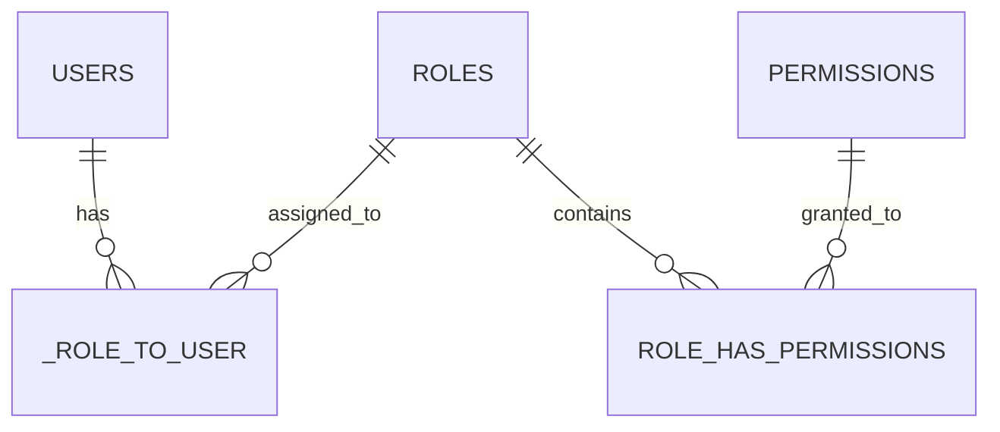

# Backend Feature: Autentikasi & PBAC - SITIVENT (Untitled)

> **Version**: 1.0.0  
> **Module**: Core / Authentication & PBAC  
> **Stack**: Go 1.25+ (Gin) + JWT HS256 + Redis 7 + Bcrypt + PostgreSQL

---

## 1. Arsitektur Autentikasi Backend

Autentikasi di backend Go menggunakan pola **Stateless JWT** yang didukung **Redis Permission Cache**:

- **Tabel Database**: `core.users`, `core.sessions`, `core.accounts`, `core.verifications`, `core.roles`, `core.permissions`, `core.role_has_permissions`, `core._role_to_user`.
- **Password Hashing**: Menggunakan `golang.org/x/crypto/bcrypt` dengan salt terenkripsi.
- **JWT Token Generation (`pkg/jwt`)**:
  - Algorithm: HS256
  - Secret: `JWT_SECRET` (minimum 32 karakter)
  - Claims: `user_id`, `email`, `roles`, `iss: "untitled-api"`, `exp: 24h`
- **Google OAuth / Firebase Verification (`pkg/firebase`)**:
  - Verifikasi ID token via Firebase Admin SDK untuk flow sign-in Google dari frontend.

---

## 2. Model Relasi PBAC (Permission-Based Access Control)

- **Roles Bawaan**:
  - `superadmin`: Akses penuh ke seluruh fitur dan pengaturan.
  - `panitia`: Manajemen event, registrasi, verifikasi bukti bayar, absensi, sertifikat, dan tiket bantuan.
  - `scanner`: Hak khusus melakukan pemindaian QR absensi dan melihat data peserta.
  - `peserta`: Pendaftaran event, upload bukti bayar, unduh tiket QR, dan sertifikat.

---

## 3. Middleware Otorisasi & Redis Caching

1. **`middleware.RequireAuth()`**:
   - Mengekstrak token dari header `Authorization: Bearer <token>`.
   - Memvalidasi signature dan expired time token.
   - Menyimpan `userID` dan `roles` ke dalam `gin.Context`.
2. **`middleware.RequirePermission(permissionName string)`**:
   - Membaca daftar permission user dari Redis Cache (`user_permissions:{userId}`).
   - Jika cache-miss: Mengambil dari tabel `role_has_permissions` & `_role_to_user` lalu menyimpannya ke Redis (TTL 10 menit).
   - Memeriksa apakah `permissionName` ada dalam daftar izin user.
3. **Invalidasi Cache**:
   - Saat admin mengubah permission role atau user, backend mengeksekusi `DEL user_permissions:{userId}` di Redis.
