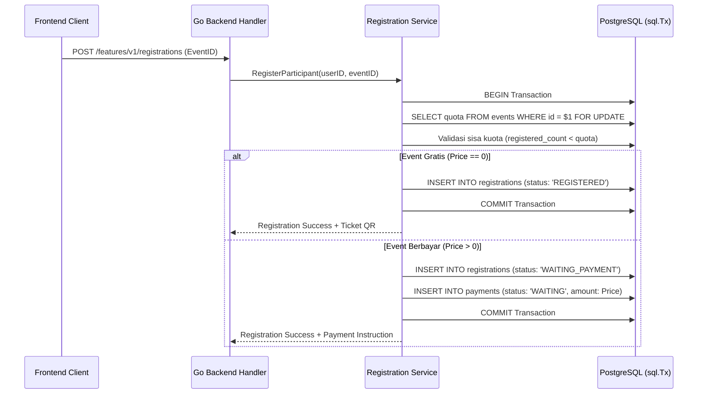

# Backend Feature: Registrasi & Tiket QR - SITIVENT (Untitled)

> **Version**: 1.0.0  
> **Module**: Features / Registrations & QR Tickets  
> **Stack**: Go 1.25+ (Gin) + PostgreSQL Transaksional + Crypto Rand

---

## 1. Arsitektur Data Registrasi

- **Tabel Utama**: `registrations`
  - `id`: VARCHAR(36) PK
  - `event_id`: FK ke `events(id)`
  - `user_id`: FK ke `users(id)`
  - `registration_number`: Unique string (`REG-{SLUG}-{YEAR}-{COUNTER}`)
  - `qr_token`: Unique random cryptographic string
  - `online_attendance`: Boolean
  - `status`: `WAITING_PAYMENT`, `REGISTERED`, `CANCELLED`, `CHECKED_IN`
  - `created_at`, `updated_at`, `deleted_at`

---

## 2. Alur Pendaftaran & Transaksi Database

---

## 3. Validasi & Ketentuan Transaksional

1. **Pencegahan Pendaftaran Ganda**: Pengecekan pendaftaran aktif untuk pasangan `(user_id, event_id)`.
2. **Kunci Baris Transaksional**: Memanfaatkan `FOR UPDATE` untuk menjamin kuota tidak terlampaui saat terjadi pendaftaran serentak (*concurrency safety*).
3. **Generasi QR Token**: Dihasilkan menggunakan `crypto/rand` berkekuatan 32-byte hex yang tidak dapat dipalsukan.
